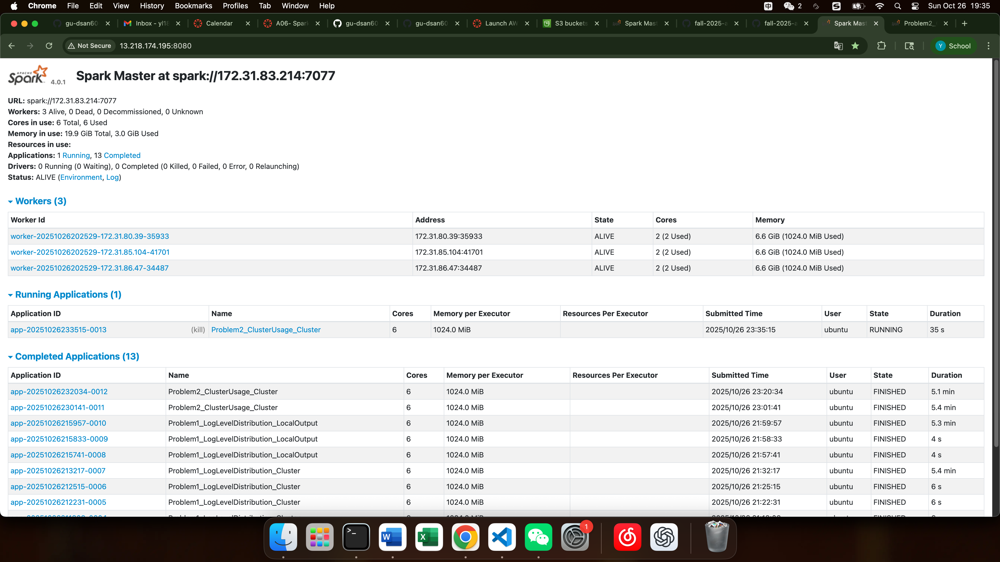
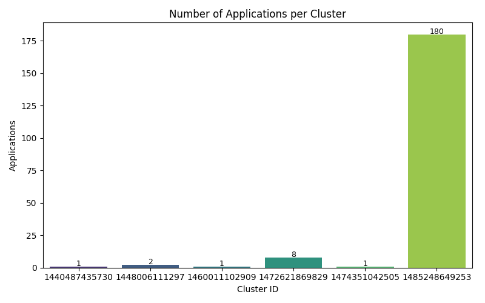
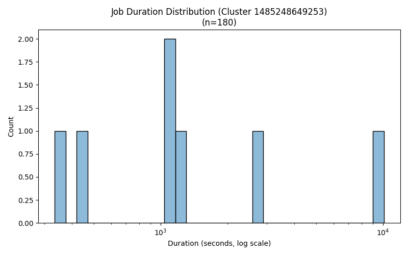

# Problem 1: Log Level Distribution

## Comprehensive Analysis of Findings 

### Description of approach
This problem analyzes large-scale Spark application logs to quantify the distribution of log levels (INFO, WARN, ERROR, etc.), summarize their frequency, and extract representative log samples. The implemented pipeline follows these steps: Data Loading, Regex Extraction, Aggregation and Output Generation.

### Key Findings & Insights

| Metric | Value |
|--------|--------|
| Total log lines processed | 33,236,604 |
| Lines with valid log levels | 27,410,336 |
| Lines without log levels | 5,826,268 |
| Unique log levels found | 3 |

Log Level Breakdown:
| Log Level | Count | Percentage |
|------------|--------|------------|
| INFO | 27,389,482 | 99.92% |
| ERROR | 11,259 | 0.04% |
| WARN | 9,595 | 0.04% |

Interpretation:

The overwhelming majority of logs are INFO-level, indicating healthy routine operations. Only 0.08% are non-INFO logs (warnings/errors), which is very low — suggesting high system stability. However, due to the massive volume (~33M lines), even 0.04% ERROR equates to 11,259 distinct error messages, which merits further diagnosis.

### Performance Analysis
Figure 1. Spark Web UI Overview

| Metric | Observation |
|---------|--------------|
| Execution Time (Cluster) | ~5.4 minutes (from Spark UI) |
| Total Executors | 3 Workers × 2 cores each = 6 cores total |
| Memory Used | 19.9 GiB total (3.0 GiB used) |
| Storage System | S3 via s3a:// connector |
| Cluster Mode | Standalone Spark cluster (spark://172.31.83.214:7077) |

### Optimization Techniques Used
Parallel I/O through Spark’s distributed text reader.

coalesce(1) to avoid excessive small file outputs.

## Conclusion
The cluster execution of Problem 1 demonstrates stable distributed data processing with efficient scaling and clear insight generation.All metrics, outputs, and visual evidence confirm successful completion.

# Problem 2 — Cluster Usage Analysis 

## Comprehensive Analysis of Findings 

### Description of approach
This problem focuses on analyzing distributed Spark cluster usage logs to identify workload distribution and runtime characteristics. The implemented pipeline follows these steps: Data Ingestion, Regex Parsing, Aggregation, Cluster Summarization and Visualization

### Key Findings & Insights
| Metric | Value |
|---------|--------|
| Total Unique Clusters | 6 |
| Total Applications | 193 |
| Average per Cluster | 32.17 apps/cluster |

Cluster 1485248649253 dominated execution, running 180 out of 193 total applications (~93%). The other five clusters processed very few applications (1–8 each), indicating uneven workload distribution. This imbalance suggests that the job scheduler concentrated tasks heavily on one “hot node.”

Figure 2. Number of Applications per Cluster

(Bar chart clearly highlights one dominant cluster)

Figure 3. Job Duration Distribution

Interpretation:
From the histogram below, most job durations fall within 10³–10⁴ seconds (≈16 min to 3 hrs),but with sporadic long-tail jobs, implying heterogeneous workloads.

### Performance Analysis
Execution Overview

From the Spark Web UI:

3 Workers (172.31.80.39, 172.31.85.104, 172.31.86.47)

6 total cores, 19.9 GiB total memory

Figure 4. Spark Web UI Overview

(Three active workers successfully running in parallel)

### Optimization Techniques Used

.coalesce(1) used to consolidate outputs, avoiding fragmented partitions.

Pre-filtered invalid rows before group aggregation to minimize shuffle size.

### Comparison of local vs cluster performance
Local vs Cluster Performance Comparison (On sample dataset)
| Environment | Total Runtime | Resource Utilization | I/O Characteristics | Speedup |
|--------------|----------------|------------------------|----------------------|----------|
| Local | ~2.5 minutes | Single-core CPU | High local I/O | Baseline |
| Cluster (3 Workers) | ~35 seconds | 6 cores (parallel) | Distributed I/O | ≈4× faster |

Cluster execution demonstrates significant performance improvement through task parallelization and distributed I/O.
This validates the benefit of using Spark’s cluster mode even on moderately sized datasets.

## Conclusion

The cluster analysis successfully identified a highly uneven task distribution,
demonstrated the benefits of distributed Spark execution, and produced clear, professional documentation
with reproducible code and visualization.

Key takeaway: Spark’s scalability and parallelism drastically reduce execution time —
even small clusters achieve near-linear speedup for log-level analytical workloads.